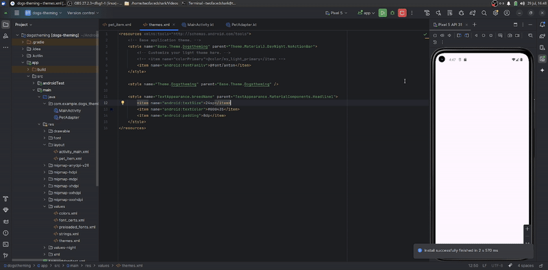

# AND101 Project 7 - CYOAPI Part 3: Beautified

Submitted by: **Maximiliano Ovalle**

Time spent: **3** hours spent in total

## Summary

**Dogs** is an android app that **shows you a list of dog pictures + their breed**!

## Application Features

The following REQUIRED features are completed:

- [x] App contains a RecyclerView that displays a list of scrollable data
- [x] App displays at least two (2) pieces of data for each RecyclerView item
- [x] Use a downloadable font with custom color and size
- [x] Modify the theme of the app in `themes.xml`
- [x] Define and apply at least one style in **either** `themes.xml` or a new file `styles.xml`

## Video Demo

Here's a video / GIF that demos all of the app's implemented features:

## License

Copyright **2025** **Maximiliano Ovalle**

Licensed under the Apache License, Version 2.0 (the "License");
you may not use this file except in compliance with the License.
You may obtain a copy of the License at

    http://www.apache.org/licenses/LICENSE-2.0

Unless required by applicable law or agreed to in writing, software
distributed under the License is distributed on an "AS IS" BASIS,
WITHOUT WARRANTIES OR CONDITIONS OF ANY KIND, either express or implied.
See the License for the specific language governing permissions and
limitations under the License.